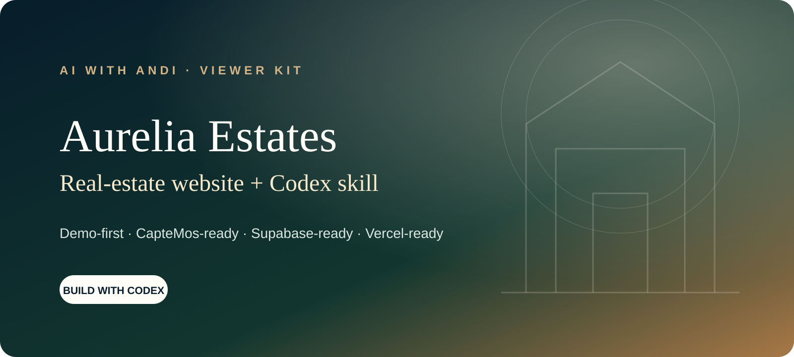

<div align="center">

# CapteMos Real Estate Site Builder

### A premium Next.js property website and reusable Codex skill

[](https://nextjs.org/)
[](https://www.typescriptlang.org/)
[](https://github.com/aiwithandi/captemos-real-estate-site-builder/actions/workflows/ci.yml)
[](LICENSE)

**Demo-first · CapteMos-ready · Supabase-ready · Vercel-ready**

</div>

This is the complete viewer kit from the **AI with Andi** real-estate website tutorial. It includes the Aurelia Estates website, realistic demonstration listings, secure integration boundaries, and an installable Codex skill that guides the customization and verification workflow.

No API account is required to see the website. Clone it, run it locally, and connect private services only when you are ready.

## What you get

| Experience | Included |
|---|---|
| Premium responsive homepage | Yes |
| Buy and Rent catalogues with URL filters | Yes |
| Individual property pages | Yes |
| Areas, Relocation, Journal, Sell, and Contact | Yes |
| Browser-local Favorites | Yes |
| Five-step buyer Matchmaker | Yes |
| CapteMos live portfolio adapter | Optional, server-only |
| Supabase enquiries and Matchmaker storage | Optional, protected by RLS |
| Demo-data fallback | Always available |
| Sitemap, robots, metadata, and accessible forms | Yes |
| Codex skill and verification workflow | Included |

## Quick start — see the website

You need Node.js 22 or newer.

```bash
git clone https://github.com/aiwithandi/captemos-real-estate-site-builder.git
cd captemos-real-estate-site-builder
npm install
cp .env.example .env.local
npm run dev
```

Open [http://localhost:3000](http://localhost:3000). The site automatically uses its bundled demonstration portfolio.

## Use the included Codex skill

Install the project skill once:

```bash
mkdir -p ~/.codex/skills
cp -R skill/captemos-real-estate-site-builder ~/.codex/skills/
```

Restart Codex, open the cloned repository, and send:

```text
Use $captemos-real-estate-site-builder to customize this property website
for my agency and market. Keep demo mode available, show me each visible
milestone, run every required check, and do not publish anything yet.
```

Then describe the brand, market, audience, services, and preferred visual direction in ordinary language. The skill keeps the implementation and safety checks inside the project.

## Connect live CapteMos properties

Add these values only to `.env.local` or your hosting provider’s protected environment settings:

```dotenv
CAPTEMOS_BASE_URL=https://captemos2.vercel.app
CAPTEMOS_API_KEY=<your-private-key>
```

Restart the development server. The homepage displays `Live CapteMos feed` when a valid portfolio is active. If the connection is absent or unavailable, the website safely returns to demo listings.

> `CAPTEMOS_API_KEY` must remain server-only. Never prefix it with `NEXT_PUBLIC_`, paste it into a Client Component, commit it, or show it during a recording.

See [the CapteMos connection guide](skill/captemos-real-estate-site-builder/references/captemos.md).

## Store enquiries in Supabase

1. Create or select a verified development Supabase project.
2. Apply [`supabase/schema.sql`](supabase/schema.sql).
3. Create the agency owner user and copy that user’s UUID.
4. Add the following values privately:

```dotenv
NEXT_PUBLIC_SUPABASE_URL=
NEXT_PUBLIC_SUPABASE_ANON_KEY=
SUPABASE_SERVICE_ROLE_KEY=
SITE_OWNER_ID=
```

5. Restart the app and submit clearly labelled test data through Contact and Matchmaker.

With all four variables configured, each route stores a record owned by `SITE_OWNER_ID`. With none configured, the public demo returns an honest **Demo complete** message and stores nothing. Partial configuration fails closed.

Read [the complete Supabase safety guide](skill/captemos-real-estate-site-builder/references/database.md) before applying the schema.

## Environment variables

| Variable | Visibility | Required | Purpose |
|---|---|---:|---|
| `CAPTEMOS_BASE_URL` | Server | No | CapteMos service base URL |
| `CAPTEMOS_API_KEY` | **Server secret** | No | Authenticates the live property feed |
| `NEXT_PUBLIC_SUPABASE_URL` | Public | For stored leads | Supabase project URL |
| `NEXT_PUBLIC_SUPABASE_ANON_KEY` | Public | For client expansion | Supabase anonymous key |
| `SUPABASE_SERVICE_ROLE_KEY` | **Server secret** | For stored leads | Server-only lead insert access |
| `SITE_OWNER_ID` | **Server private** | For stored leads | Assigns leads to the agency owner |
| `NEXT_PUBLIC_SITE_URL` | Public | For deployment | Canonical metadata and sitemap URL |
| `DEMO_USER_PASSWORD` | **Development secret** | For optional seed | No fixed password is shipped |

## Verification

Run the same checks used for the public repository:

```bash
npm run check
npm run build
```

Then verify these paths at desktop width and 390-pixel mobile width:

- `/`
- `/buy`
- one `/properties/[slug]` page
- `/favorites`
- `/matchmaker`
- `/contact`

For a live setup, verify both the on-page property-source label and sanitized test records in Supabase. A visual success state alone is not proof that a lead was stored.

## Deploy a preview to Vercel

1. Fork this repository into your own GitHub account.
2. Import the fork into Vercel.
3. Add environment variables in Vercel’s protected settings—not in the repository.
4. Set `NEXT_PUBLIC_SITE_URL` to the preview or production URL.
5. Deploy and repeat the buyer-journey verification on the preview.
6. Connect production DNS only after the preview has been approved.

## Security model

- All private credentials remain on the server.
- `.env.*` files, Vercel state, keys, logs, and certificates are ignored.
- Public demo forms disclose that data was not stored.
- Live forms validate and limit input, verify same-origin browser requests, use a honeypot, and apply a lightweight request throttle.
- Supabase lead writes use a server route; anonymous visitors receive no read access.
- The optional remote seed is blocked unless deliberately enabled.
- GitHub Actions verify linting, types, and the production build.
- Dependabot checks npm and GitHub Actions dependencies.

Before opening the site to public traffic, add durable platform-level rate limiting or bot protection and review [`SECURITY.md`](SECURITY.md).

## Project map

```text
src/app/                     Next.js routes and protected form endpoints
src/components/              Property, Favorite, enquiry, and Matchmaker UI
src/data/demo-feed.json      Safe local demonstration portfolio
src/lib/properties.ts        CapteMos adapter and fallback
src/lib/submissions.ts       Protected Supabase submission boundary
supabase/schema.sql          Tables, indexes, and Row Level Security
skill/                       Installable Codex skill and references
.github/                     CI and dependency maintenance
```

## Make it yours

Replace the fictional Aurelia brand, demonstration contact details, and prototype images before commercial use. Use property photos and listing content you own or are authorized to publish. Verify legal pages, cookie requirements, privacy notices, accessibility, and property advertising rules for your market.

## License

Code is released under the [MIT License](LICENSE). Demonstration property content and the Aurelia identity are provided as editable prototype material; replace them for a real agency.

---

<div align="center">

Built for the **AI with Andi** YouTube community.<br>
If you build your own version, share your market and the page you started with.

</div>
